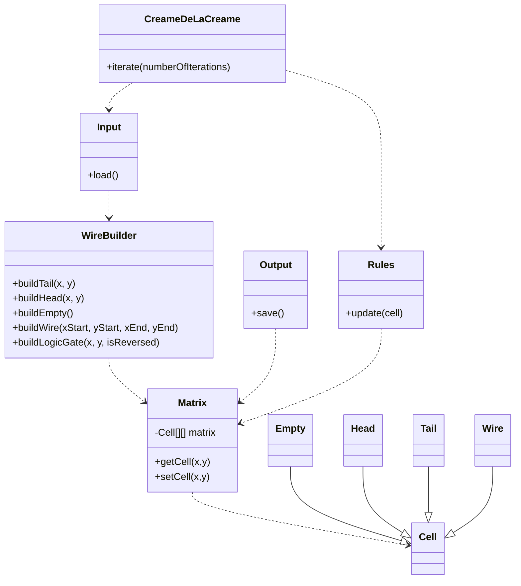

## Diagrams

Mermaid Diagram:

```mermaid
classDiagram
Matrix ..> Cell
CreameDeLaCreame ..> Rules
WireBuilder ..> Matrix
CreameDeLaCreame ..> Input
Input ..> WireBuilder
Output ..> Matrix
Rules ..> Matrix
Empty --|> Cell
Head --|> Cell
Tail --|> Cell
Wire --|> Cell
Output : +save()
Input : +load()
class WireBuilder {
+buildTail(x, y)
+buildHead(x, y)
+buildEmpty()
+buildWire(xStart, yStart, xEnd, yEnd)
+buildLogicGate(x, y, isReversed)
}
CreameDeLaCreame : +iterate(numberOfIterations)
Rules : +update(cell)
class Matrix {
-Cell[][] matrix
+getCell(x,y)
+setCell(x,y)
}
```