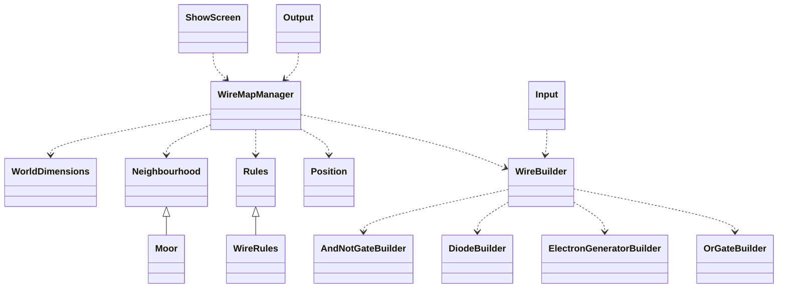

## Diagrams

Mermaid Diagram:

### Diode:

To w jakim kierunku ma zostać ona zbudowana jest wyznaczane z jej środka

### OrGate:

To w jakim kierunku ma zostać zbudowany jest wyznaczane ze środka

### ElectronGenerator:

To w jakim kierunku ma zostać zbudowany jest wyznaczane z przeciwnego rogu, czyli dla SW będzie to lewy górny róg, dla
NE będzie to prawy dolny róg